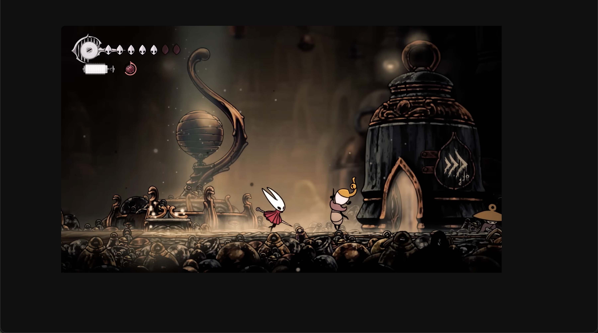

# Minimal Youtube

Sometimes I get stuck a couple of hours in Youtube because the algorithm it's too good and I find myself opening recommended videos in new tabs, here is my solution to stop doing that.

It allows you can hide the following sections from your Youtube page

* Recommended videos
* Comments
* Metadata (Interactive buttons, channel name, view, etc...)

So you can change from this view

To this one

And stop doom scrolling (or whatever is equivalent in PC) to get some stuff done.

## Installation

You can install directly from the chrome extension's store [here](https://chromewebstore.google.com/).

## License

This project is under the MIT license.